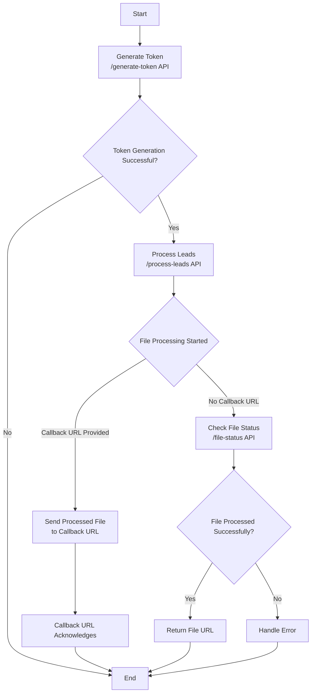

# **Reworked API Documentation**

## Base URL
Contact your point of contact at Reworked.ai to obtain the base URL

## **Generate JWT Token**
### Endpoint
`/generate-token`

### Method
`POST`

### Request Body
```json
{
    "api_key": "api-key",
    "email": "abc@gmail.com"
}
```
- `api_key` will be provided by Reworked.
- `email` email id you used to create an account on Reworked.ai.

### Response
Status Code: `200`
```json
{
    "msg": "Token generated successfully",
    "data": {
        "token": "Auth Token",
        "expires_at": "Timestamp"
    }
}
```
- The token should be sent as an authorization header in the `process-leads` API.
- The token will be valid for 24 hours.

### Error Cases
Status Code: `404`
```json
{
    "msg": "Api key is invalid",
    "data": null
}
```

Status Code: `404`
```json
{
    "msg": "Customer data not found",
    "data": null
}
```
---

## Process Leads
### Endpoint
`/process-leads`

### Method
`POST`

### Headers
```json
{
    "Authorization": "Authorization Token from generate-token API response"
}
```
### Request Body
```json
{
    "file_url": "file upload file url",
    "email": "email",
    "callback_url": "callback_url",
    "overwrite" : true,
    "industry_profile_type": "industry_type",
    "input_type":"url",
    "industry_profile_id": "industry_profile_id",
    "customer_request_id":"customer_request_id"
}
```

###  Required Fields

* **`email`**: Your email address.

---

###  Optional Fields (Based on `input_type`)

* **`input_type`**: Either `"url"` (to upload via file URL) or `"json"` (to send raw data directly).

* If **`input_type` is `"url"`**, include:

  * **`file_url`**: A valid URL pointing to the file you want to process.

* If **`input_type` is `"json"`**, include:

  * **`input_data`**: Your data as a JSON object.

---

###  Optional Configuration

* **`callback_url`**: A URL that will be notified when processing is complete.
* **`industry_profile_type`**: One of:
  `"REAL_ESTATE_INVESTORS"`, `"SOLAR_INSTALLER"`, `"INSURANCE_PROVIDER"`, `"ROOFING"`.
* **`industry_profile_id`**: A specific industry profile ID if you want to use a specific industry profile.
* **`overwrite`**: Boolean (`true` or `false`) – determines whether existing data should be overwritten.
* **`customer_request_id`**: external order id of the file

> **Important Note**: If both `industry_profile_type` and `industry_profile_id` are provided, the `industry_profile_type` will take precedence.

### Required Columns in File
```json
[
    "owner_full_name",
    "mail_street_address",
    "mail_city",
    "mail_state",
    "mail_zip_code",
    "property_zip_code"
]
```
### Response
Status Code: `200`
```json
{
    "msg": "File processing started",
    "data": {
        "token": "auth token to be used in file-status API",
        "file_upload_identifier": "file upload identifier",
        "status": "PROCESSING"
    }
}
```
- `token` is to be used in the `file-status` API. The token will be valid for 24 hours.
- `file_upload_identifier` - unique identifier of your request


Status Code: `200`
```json
{
    "msg": "File is already in process, pls check after sometime",
    "data": {
        "error_detail": null,
        "token": "token",
        "file_upload_identifier": "67ce8b31124dd1006877c212",
        "status": "PROCESSING"
    }
}
```
- `status` - PROCESSED/ERROR/PROCESSING/UNDERREVIEW

### Error Cases
Status Code: `400`
```json
{
    "msg": "File url is missing",
    "data": null
}
```
Common error messages:
* `"Invalid token"` - JWT token email doesn't match request email
* `"Invalid industry_profile_type provided. Allowed values are: REAL_ESTATE_INVESTORS, SOLAR_INSTALLER, INSURANCE_PROVIDER, ROOFING"` - When industry_profile_type is invalid
---

## File Status
### Endpoint
`/file-status`

### Method
`POST`

### Headers
```json
{
    "Authorization": "token from process-leads API response"
}
```

### Request Body
```json
{
    "file_upload_identifier": "file upload identifier",
    "email": "email"
}
```
- `file_upload_identifier` is obtained from the process-leads response.

### Response
Status Code: `200`
```json
{
    "msg": "File is already in process, pls check after sometime",
    "data": {
        "error_detail": null,
        "token": "token",
        "file_upload_identifier": "67ce8b31124dd1006877c212",
        "status": "PROCESSING"
    }
}
```


Status Code: `200`
```json
{
    "msg": "File is under review, it should be processed within the next 12hrs.",
    "data": {
        "token": "token",
        "file_upload_identifier": "67ce8b31124dd1006877c212",
        "status": "UNDERREVIEW"
    }
}
```
### Error Cases
Status Code: `500`
```json
{
    "msg": "Error 101: Please sign up for a plan at reworked.ai before proceeding. You can also contact admin@reworked.ai or call at +1 888 306 1949.",
    "data": {
        "error_detail": "Error 101: Please sign up for a plan at reworked.ai before proceeding. You can also contact admin@reworked.ai or call at +1 888 306 1949.",
        "status": "ERROR"
    }
}
```
Status Code: `500`
```json
{
    "msg": "Error 102: Payment method failed, please update payment method at reworked.ai before proceeding. You can also contact admin@reworked.ai or call at +1 888 306 1949.",
    "data": {
        "error_detail": "Error 102: Payment method failed, please update payment method at reworked.ai before proceeding. You can also contact admin@reworked.ai or call at +1 888 306 1949.",
        "status": "ERROR"
    }
}
```
Status Code: `500`
```json
{
    "msg": "Error 103: Requisite columns required to generate a Betty Score is not present. Please contact admin@reworked.ai or call at +1 888 306 1949.",
    "data": {
        "error_detail": "Error 103: Requisite columns required to generate a Betty Score is not present. Please contact admin@reworked.ai or call at +1 888 306 1949.",
        "status": "ERROR"
    }
}
```
Status Code: `500`
```json
{
    "msg": "Error 104: Please create an investment profile at reworked.ai before proceeding. You can also contact admin@reworked.ai or call at +1 888 306 1949.",
    "data": {
        "error_detail": "Error 104: Please create an investment profile at reworked.ai before proceeding. You can also contact admin@reworked.ai or call at +1 888 306 1949.",
        "status": "ERROR"
    }
}
```
- `status` - PROCESSED/ERROR/PROCESSING/UNDERREVIEW
---

## API Flowchart


# API Sequence Diagram

Below is the sequence diagram for API interactions:


