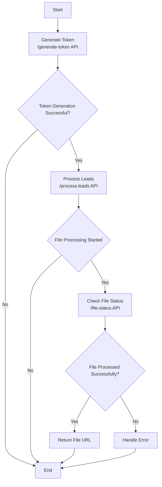

# **Reworked API Documentation**

## Base URL
`/api`

## **Generate Token**
### Endpoint
`/generate-token`

### Method
`POST`

### Request Body
```json
{
    "api_key": "api-key",
    "email": "abc@gmail.com"
}
```
- `api_key` will be provided by Reworked.
- `email` is the ID from which you created a Reworked account.

### Response
Status Code: `200`
```json
{
    "msg": "Token generated successfully",
    "data": {
        "token": "Auth Token",
        "expires_at": "Timestamp"
    }
}
```
- The token should be sent as an authorization header in the `process-leads` API.
- The token will be valid for 24 hours.

### Error Cases
Status Code: `404`
```json
{
    "msg": "Api key is invalid",
    "data": null
}
```

Status Code: `404`
```json
{
    "msg": "Customer data not found",
    "data": null
}
```
---

## Process Leads
### Endpoint
`/process-leads`

### Method
`POST`

### Headers
```json
{
    "Authorization": "Authorization Token"
}
```
- `Authorization` - token from generate-token API response
### Request Body
```json
{
    "file_url": "file upload file url",
    "email": "email",
    "callback_url": "callback_url"
}
```
- `file_url` - The URL of the file to process.
- `callback_url` - URL to be called once file processing is completed. ( Optional )

### Required Columns in File
```json
[
    "owner_full_name",
    "mail_street_address",
    "mail_city",
    "mail_state",
    "mail_zip_code",
    "lot_area_sqft",    
    "apn",             
    "property_zip_code"
]
```
- `lot_area_sqft` and `apn` are applicable for **LAND** type.
### Response
Status Code: `200`
```json
{
    "msg": "File processing started",
    "data": {
        "token": "auth token",
        "file_upload_identifier": "file upload identifier",
        "status": "PROCESSING"
    }
}
```
- `token` is to be used in the `file-status` API. The token will be valid for 24 hours.
- `file_upload_identifier` - unique identifier of your request


Status Code: `200`
```json
{
    "msg": "File is already in process, pls check after sometime",
    "data": {
        "error_detail": null,
        "token": "token",
        "file_upload_identifier": "67ce8b31124dd1006877c212",
        "status": "PROCESSING"
    }
}
```


Status Code: `200`
```json
{
    "msg": "File is under review",
    "data": {
        "error_detail": null,
        "token": "token",
        "file_upload_identifier": "67ce8b31124dd1006877c212",
        "status": "UNDERREVIEW"
    }
}
```
### Error Cases
Status Code: `500`
```json
{
    "msg": "Error 101: Please sign up for a plan at reworked.ai before proceeding. You can also contact admin@reworked.ai or call at +1 888 306 1949.",
    "data": {
        "error_detail": "Error 101: Please sign up for a plan at reworked.ai before proceeding. You can also contact admin@reworked.ai or call at +1 888 306 1949.",
        "status": "ERROR"
    }
}
```
Status Code: `500`
```json
{
    "msg": "Error 102: Payment method failed, please update payment method at reworked.ai before proceeding. You can also contact admin@reworked.ai or call at +1 888 306 1949.",
    "data": {
        "error_detail": "Error 102: Payment method failed, please update payment method at reworked.ai before proceeding. You can also contact admin@reworked.ai or call at +1 888 306 1949.",
        "status": "ERROR"
    }
}
```
Status Code: `500`
```json
{
    "msg": "Error 103: Requisite columns required to generate a Betty Score is not present. Please contact admin@reworked.ai or call at +1 888 306 1949.",
    "data": {
        "error_detail": "Error 103: Requisite columns required to generate a Betty Score is not present. Please contact admin@reworked.ai or call at +1 888 306 1949.",
        "status": "ERROR"
    }
}
```
Status Code: `500`
```json
{
    "msg": "Error 104: Please create an investment profile at reworked.ai before proceeding. You can also contact admin@reworked.ai or call at +1 888 306 1949.",
    "data": {
        "error_detail": "Error 104: Please create an investment profile at reworked.ai before proceeding. You can also contact admin@reworked.ai or call at +1 888 306 1949.",
        "status": "ERROR"
    }
}
```
- `status` - PROCESSED/ERROR/PROCESSING/UNDERREVIEW
---

## File Status
### Endpoint
`/file-status`

### Method
`POST`

### Headers
```json
{
    "Authorization": "token from process-leads API response"
}
```

### Request Body
```json
{
    "file_upload_identifier": "file upload identifier",
    "email": "email"
}
```
- `file_upload_identifier` is obtained from the process-leads response.

### Response
Status Code: `200`
```json
{
    "msg": "File is already in process, pls check after sometime",
    "data": {
        "error_detail": null,
        "token": "token",
        "file_upload_identifier": "67ce8b31124dd1006877c212",
        "status": "PROCESSING"
    }
}
```


Status Code: `200`
```json
{
    "msg": "File is under review",
    "data": {
        "error_detail": null,
        "token": "token",
        "file_upload_identifier": "67ce8b31124dd1006877c212",
        "status": "UNDERREVIEW"
    }
}
```
### Error Cases
Status Code: `500`
```json
{
    "msg": "Error 101: Please sign up for a plan at reworked.ai before proceeding. You can also contact admin@reworked.ai or call at +1 888 306 1949.",
    "data": {
        "error_detail": "Error 101: Please sign up for a plan at reworked.ai before proceeding. You can also contact admin@reworked.ai or call at +1 888 306 1949.",
        "status": "ERROR"
    }
}
```
Status Code: `500`
```json
{
    "msg": "Error 102: Payment method failed, please update payment method at reworked.ai before proceeding. You can also contact admin@reworked.ai or call at +1 888 306 1949.",
    "data": {
        "error_detail": "Error 102: Payment method failed, please update payment method at reworked.ai before proceeding. You can also contact admin@reworked.ai or call at +1 888 306 1949.",
        "status": "ERROR"
    }
}
```
Status Code: `500`
```json
{
    "msg": "Error 103: Requisite columns required to generate a Betty Score is not present. Please contact admin@reworked.ai or call at +1 888 306 1949.",
    "data": {
        "error_detail": "Error 103: Requisite columns required to generate a Betty Score is not present. Please contact admin@reworked.ai or call at +1 888 306 1949.",
        "status": "ERROR"
    }
}
```
Status Code: `500`
```json
{
    "msg": "Error 104: Please create an investment profile at reworked.ai before proceeding. You can also contact admin@reworked.ai or call at +1 888 306 1949.",
    "data": {
        "error_detail": "Error 104: Please create an investment profile at reworked.ai before proceeding. You can also contact admin@reworked.ai or call at +1 888 306 1949.",
        "status": "ERROR"
    }
}
```
- `status` - PROCESSED/ERROR/PROCESSING/UNDERREVIEW
---

## Authenticate User
### Endpoint
`/user-authenticate`

### Method
`POST`

### Request Body
```json
{
    "email": "email",
    "password": "password"
}
```

### Success Response
Status Code: `200`
```json
{
    "msg": "User Authenticated Successfully",
    "data": {
        "api_secret_key": "api_secret_key"
    }
}
```

### Error Responses
#### Invalid Email ID
Status Code: `400`
```json
{
    "msg": "Invalid Email ID",
    "data": {}
}
```

#### Wrong Password
Status Code: `403`
```json
{
    "msg": "Password is not correct",
    "data": {
        "error_detail": {
            "message": "Request failed with status code 403"
        }
    }
}
```
---


## API Flowchart


# API Sequence Diagram

Below is the sequence diagram for API interactions:


